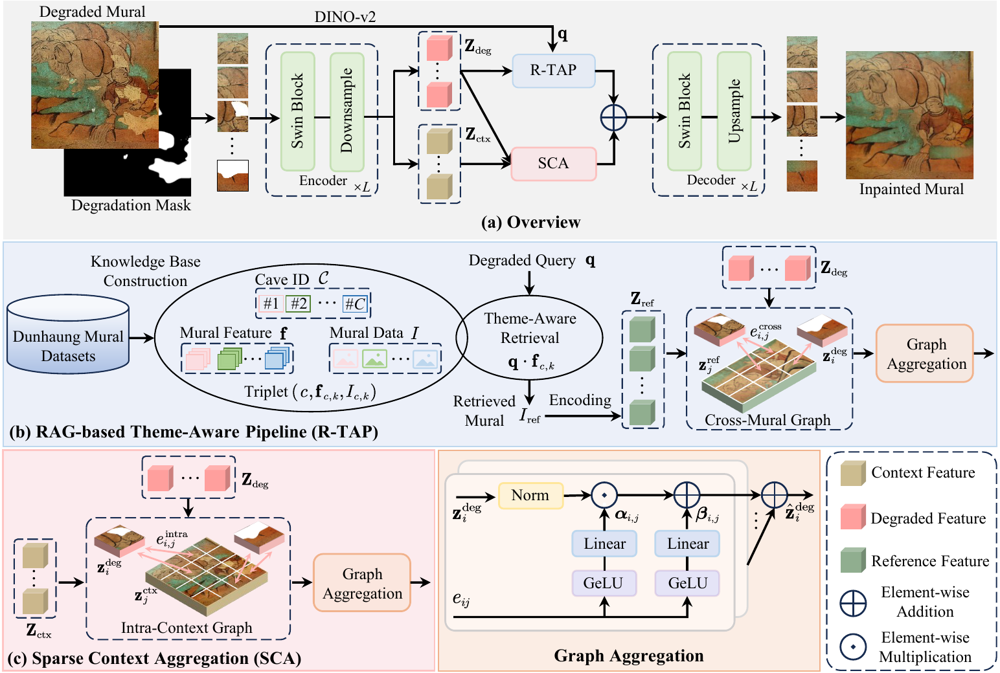

# Dunhuang-TACO

Official PyTorch implementation of **Dunhuang-TACO: Theme-Aware Coherent
Inpainting for Dunhuang Murals**.

## Dataset

The cave-organized **ThemeDH** dataset used for training and evaluation is
publicly available on [Hugging Face](https://huggingface.co/datasets/jibao123/ThemeDH).
The repository retains the predefined training and test splits organized by
cave, enabling reproduction of the experimental protocol reported in the paper.

## Network Architecture

Dunhuang-TACO partitions a degraded high-resolution mural into non-overlapping
256 x 256 patches. Each patch is processed by a four-stage hierarchical Swin
encoder. A 4 x 4 stride-4 patch embedding produces 96-channel features, followed
by stages with 96, 192, 384, and 768 channels. Every stage contains two Swin
blocks with 3, 6, 12, and 24 attention heads, respectively; the first stage uses
a 16 x 16 window and the remaining stages use 8 x 8 windows. Residual
convolutional Patch Merging halves the feature resolution between adjacent
stages. The encoded features are divided into degraded and intact context tokens
and enhanced by two parallel branches:

- **Sparse Context Aggregation (SCA)** builds an intra-mural sparse graph to
  propagate long-range structural cues from intact regions.
- **RAG-based Theme-Aware Pipeline (R-TAP)** uses DINO-v2 to retrieve a
  thematically relevant mural and injects its reference features through a
  cross-mural sparse graph.

The two enhanced representations are fused and decoded by a symmetric
skip-connected Swin decoder with residual convolutional Patch Expansion to
produce the restored mural.
