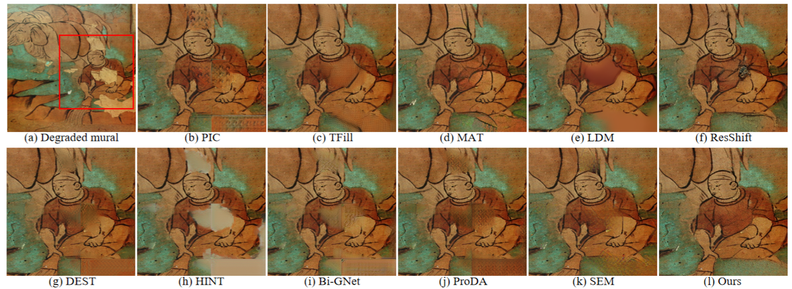

# Dunhuang-TACO: Theme-Aware Coherent Inpainting for Dunhuang Murals

Official implementation of **Dunhuang-TACO**, a framework for large‑format cross‑cave Dunhuang mural restoration that tackles inter‑cave thematic gaps and structural incoherence.

---

## Visual Result

**Cave 154 Restoration Example**

*Dunhuang‑TACO faithfully reconstructs intricate limb structures and clothing folds, preserving the cave’s distinctive narrative style.*

---

## More Information

- 📄 Paper (coming soon)
- 📚 ThemeDH Dataset (coming soon)
- 🛠️ Code and pretrained models (coming soon)
